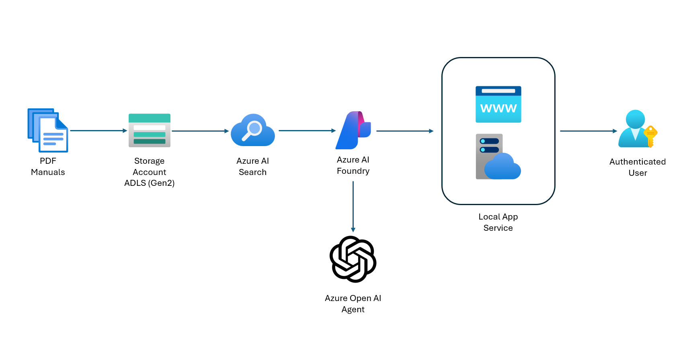

# AgentCarRepair Application Architecture



--- 

## 🏗️ System Architecture Overview

```
┌─────────────────────────────────────────────────────────────────────────────────┐
│                           USER INTERACTION LAYER                                │
├─────────────────────────────────────────────────────────────────────────────────┤
│  ┌─────────────┐  ┌─────────────┐  ┌─────────────┐  ┌─────────────┐           │
│  │   Desktop   │  │   Mobile    │  │   Tablet    │  │  API Client │           │
│  │   Browser   │  │   Browser   │  │   Browser   │  │    (curl)   │           │
│  └─────────────┘  └─────────────┘  └─────────────┘  └─────────────┘           │
│            │              │              │              │                     │
│            └──────────────┼──────────────┼──────────────┘                     │
│                          │              │                                     │
│                     HTTP/HTTPS Requests                                       │
│                          │              │                                     │
└─────────────────────────────────────────────────────────────────────────────────┘
                            │              │
                            ▼              ▼
┌─────────────────────────────────────────────────────────────────────────────────┐
│                        WEB APPLICATION LAYER                                    │
├─────────────────────────────────────────────────────────────────────────────────┤
│                          Flask Web Server                                      │
│  ┌─────────────────────────────────────────────────────────────────────────┐   │
│  │                       AgentRepair.py                                   │   │
│  │  ┌─────────────┐  ┌─────────────┐  ┌─────────────┐  ┌─────────────┐  │   │
│  │  │    Route    │  │    Route    │  │    Route    │  │    Route    │  │   │
│  │  │      /      │  │ /api/chat   │  │ /api/status │  │/api/new-conv│  │   │
│  │  │  (index)    │  │  (chat)     │  │  (health)   │  │(reset chat) │  │   │
│  │  └─────────────┘  └─────────────┘  └─────────────┘  └─────────────┘  │   │
│  │                                                                     │   │
│  │  ┌─────────────────────────────────────────────────────────────────┐  │   │
│  │  │                  Session Management                              │  │   │
│  │  │  - Thread ID persistence                                        │  │   │
│  │  │  - User session state                                           │  │   │
│  │  │  - Conversation context                                         │  │   │
│  │  └─────────────────────────────────────────────────────────────────┘  │   │
│  └─────────────────────────────────────────────────────────────────────────┘   │
│                                                                               │
│  ┌─────────────────────────────────────────────────────────────────────────┐   │
│  │                     Template Engine (Jinja2)                           │   │
│  │  ┌─────────────┐              ┌─────────────┐                         │   │
│  │  │ chat.html   │              │ error.html  │                         │   │
│  │  │ - Main UI   │              │ - Error UI  │                         │   │
│  │  │ - Chat Intf │              │ - Config    │                         │   │
│  │  │ - Real-time │              │   Help      │                         │   │
│  │  └─────────────┘              └─────────────┘                         │   │
│  └─────────────────────────────────────────────────────────────────────────┘   │
└─────────────────────────────────────────────────────────────────────────────────┘
                            │
                            ▼
┌─────────────────────────────────────────────────────────────────────────────────┐
│                     AUTHENTICATION LAYER                                       │
├─────────────────────────────────────────────────────────────────────────────────┤
│                     Azure Identity Library                                     │
│  ┌─────────────────────────────────────────────────────────────────────────┐   │
│  │                  Credential Chain                                      │   │
│  │  ┌─────────────┐  ┌─────────────┐  ┌─────────────┐  ┌─────────────┐  │   │
│  │  │  Service    │  │  Managed    │  │  Azure CLI  │  │  VS Code    │  │   │
│  │  │ Principal   │  │  Identity   │  │ Credentials │  │ Credentials │  │   │
│  │  │ (Primary)   │  │             │  │             │  │             │  │   │
│  │  └─────────────┘  └─────────────┘  └─────────────┘  └─────────────┘  │   │
│  └─────────────────────────────────────────────────────────────────────────┘   │
│                                                                               │
│  Environment Variables:                                                       │
│  - AZURE_CLIENT_ID                                                           │
│  - AZURE_CLIENT_SECRET                                                       │
│  - AZURE_TENANT_ID                                                           │
└─────────────────────────────────────────────────────────────────────────────────┘
                            │
                            ▼
┌─────────────────────────────────────────────────────────────────────────────────┐
│                         AZURE CLOUD LAYER                                      │
├─────────────────────────────────────────────────────────────────────────────────┤
│                        Azure AI Foundry                                        │
│  ┌─────────────────────────────────────────────────────────────────────────┐   │
│  │                      AI Project Client                                 │   │
│  │                                                                         │   │
│  │  ┌─────────────┐  ┌─────────────┐  ┌─────────────┐  ┌─────────────┐  │   │
│  │  │   Agents    │  │   Threads   │  │  Messages   │  │    Runs     │  │   │
│  │  │ Management  │  │ Management  │  │ Management  │  │ Management  │  │   │
│  │  │             │  │             │  │             │  │             │  │   │
│  │  │ - Get Agent │  │ - Create    │  │ - Create    │  │ - Process   │  │   │
│  │  │ - List      │  │ - Manage    │  │ - List      │  │ - Monitor   │  │   │
│  │  │   Agents    │  │   Context   │  │ - Format    │  │ - Status    │  │   │
│  │  └─────────────┘  └─────────────┘  └─────────────┘  └─────────────┘  │   │
│  └─────────────────────────────────────────────────────────────────────────┘   │
│                                    │                                           │
│                                    ▼                                           │
│  ┌─────────────────────────────────────────────────────────────────────────┐   │
│  │                     Car Repair AI Agent                                │   │
│  │                                                                         │   │
│  │  ┌─────────────────────────────────────────────────────────────────┐   │   │
│  │  │                    Knowledge Base                               │   │   │
│  │  │                                                                 │   │   │
│  │  │  ┌─────────────┐  ┌─────────────┐  ┌─────────────┐            │   │   │
│  │  │  │Azure AI     │  │ Car Repair  │  │ Diagnostic  │            │   │   │
│  │  │  │Search Index │  │   Manuals   │  │ Knowledge   │            │   │   │
│  │  │  │             │  │             │  │             │            │   │   │
│  │  │  │ - Indexed   │  │ - PDF Docs  │  │ - Symptoms  │            │   │   │
│  │  │  │   Content   │  │ - Technical │  │ - Solutions │            │   │   │
│  │  │  │ - Searchable│  │   Specs     │  │ - Procedures│            │   │   │
│  │  │  └─────────────┘  └─────────────┘  └─────────────┘            │   │   │
│  │  └─────────────────────────────────────────────────────────────────┘   │   │
│  └─────────────────────────────────────────────────────────────────────────┘   │
└─────────────────────────────────────────────────────────────────────────────────┘
                                    │
                                    ▼
┌─────────────────────────────────────────────────────────────────────────────────┐
│                          DATA STORAGE LAYER                                    │
├─────────────────────────────────────────────────────────────────────────────────┤
│                     Azure Data Lake Storage Gen2                               │
│  ┌─────────────────────────────────────────────────────────────────────────┐   │
│  │                        Document Storage                                 │   │
│  │                                                                         │   │
│  │  ┌─────────────┐  ┌─────────────┐  ┌─────────────┐  ┌─────────────┐  │   │
│  │  │ Car Manuals │  │  Technical  │  │ Diagnostic  │  │   Other     │  │   │
│  │  │    (PDF)    │  │    Docs     │  │   Guides    │  │ Documents   │  │   │
│  │  │             │  │             │  │             │  │             │  │   │
│  │  │ - Make/Model│  │ - Repair    │  │ - Trouble-  │  │ - Parts     │  │   │
│  │  │   Specific  │  │   Procedures│  │   shooting  │  │   Catalogs  │  │   │
│  │  │ - Year-based│  │ - Wiring    │  │ - Error     │  │ - Service   │  │   │
│  │  │ - Multi-lang│  │   Diagrams  │  │   Codes     │  │   Bulletins │  │   │
│  │  └─────────────┘  └─────────────┘  └─────────────┘  └─────────────┘  │   │
│  └─────────────────────────────────────────────────────────────────────────┘   │
└─────────────────────────────────────────────────────────────────────────────────┘
```

## 🔄 Data Flow Architecture

```
USER REQUEST FLOW:
┌─────────────┐    ┌─────────────┐    ┌─────────────┐    ┌─────────────┐
│   Browser   │───▶│    Flask    │───▶│   Azure     │───▶│ AI Agent    │
│             │    │   Server    │    │   Auth      │    │             │
└─────────────┘    └─────────────┘    └─────────────┘    └─────────────┘
       ▲                   │                   │                   │
       │                   ▼                   ▼                   ▼
┌─────────────┐    ┌─────────────┐    ┌─────────────┐    ┌─────────────┐
│  Formatted  │◀───│   Session   │    │ AI Foundry  │───▶│  Knowledge  │
│  Response   │    │ Management  │    │  Project    │    │    Base     │
└─────────────┘    └─────────────┘    └─────────────┘    └─────────────┘

CONVERSATION FLOW:
1. User sends message via web interface
2. Flask server validates session and environment
3. Azure authentication via service principal
4. AI Foundry project client connection
5. Agent retrieval and thread management
6. Message processing and knowledge base search
7. AI response generation
8. HTML formatting and session update
9. JSON response back to user interface
```
