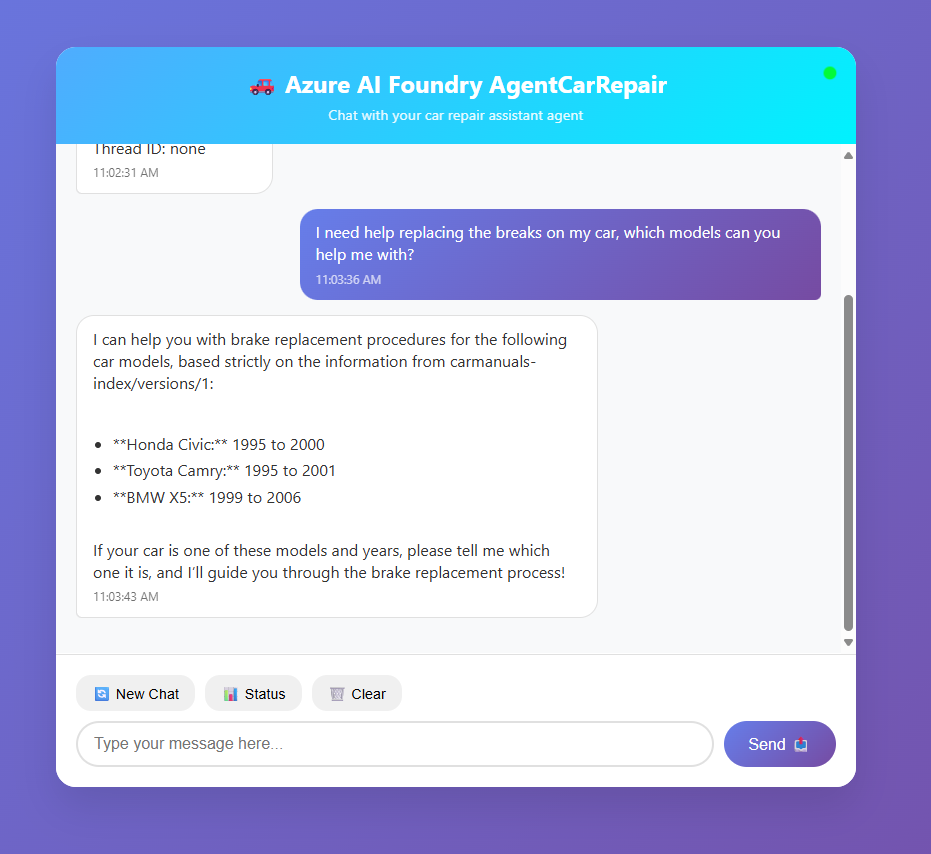

# Azure AI Foundry AgentCarRepair Web Application

A Flask-based web application that provides an interactive chat interface for car repair assistance using Azure AI Foundry agents.

## 🚗 Overview

This application serves as a web frontend for Azure AI Foundry agent services, specifically designed for automotive troubleshooting and repair guidance. Users can engage in conversational interactions with AI agents that help diagnose car problems, provide repair instructions, and offer automotive advice.




## ✨ Features

- **Interactive Chat Interface**: Modern, responsive web UI for seamless conversations
- **Azure AI Integration**: Direct connection to Azure AI Foundry agent services
- **Session Management**: Maintains conversation context across multiple messages
- **Real-time Formatting**: Automatically formats agent responses with proper HTML
- **Status Monitoring**: Built-in health checks and system status reporting
- **Mobile Responsive**: Works on desktop, tablet, and mobile devices
- **Error Handling**: Comprehensive error handling with helpful user feedback

## 🛠️ Prerequisites

### Car Repair Manuals
- Download Free Car Manuals [here](https://www.allcarmanuals.com/makesmodels.html)

### Tools
- [VS Code](https://code.visualstudio.com/download)

### Azure Requirements
- [Azure Data Lake Storage (ADLS Gen2)](https://learn.microsoft.com/en-us/azure/storage/blobs/create-data-lake-storage-account) to upload your car manuals
- [Azure AI Search](https://learn.microsoft.com/en-us/azure/search/search-get-started-portal) to index the manuals
- Azure subscription with [AI Foundry project](https://learn.microsoft.com/en-us/azure/ai-foundry/how-to/create-projects?tabs=ai-foundry&pivots=fdp-project)
- [Azure AI agent](https://learn.microsoft.com/en-us/azure/ai-foundry/agents/quickstart?pivots=ai-foundry-portal) configured for car repair assistance and add the [Azure AI Search Index as Knowledge](https://learn.microsoft.com/en-us/azure/ai-foundry/agents/how-to/tools/azure-ai-search?tabs=azurecli#add-the-azure-ai-search-tool-to-an-agent) for your agent
- [Service principal](https://learn.microsoft.com/en-us/entra/identity-platform/howto-create-service-principal-portal) with appropriate [role permissions]((https://learn.microsoft.com/en-us/azure/ai-foundry/concepts/rbac-azure-ai-foundry?pivots=fdp-project)) on your foundry Resource/projects.

### System Requirements
- Python 3.8 or higher
- pip package manager
- Modern web browser

### Required Permissions
Your service principal needs the following Azure roles:
- Cognitive Services Contributor role on the AI Foundry project resource
- Reader role on the resource group. The resource group is available in the overview page in Azure AI Foundry for your project 

## 📦 Installation

### 1. Clone the Repository
```bash
git clone https://github.com/yourusername/AgentCarRepair.git
cd AgentCarRepair
```

### 2. Create Virtual Environment (Recommended)
```bash
# Windows
python -m venv venv
venv\Scripts\activate

# macOS/Linux
python3 -m venv venv
source venv/bin/activate
```

### 3. Install Dependencies
```bash
pip install -r requirements-agentrepair.txt
```

## ⚙️ Configuration

### Environment Variables

Create a `.env` file in the project root with the following variables:

```env
# Azure Authentication
AZURE_CLIENT_ID=your-service-principal-client-id
AZURE_CLIENT_SECRET=your-service-principal-secret
AZURE_TENANT_ID=your-azure-tenant-id

# Azure AI Foundry
AZURE_ENDPOINT=https://your-endpoint.services.ai.azure.com/api/projects/your-project
AZURE_AGENT_ID=your-car-repair-agent-id

# Flask Configuration (Optional)
FLASK_SECRET_KEY=your-secret-key-for-sessions
FLASK_DEBUG=False
```

### Getting Azure Credentials

**Get AI Foundry Project Details**:
   - Navigate to your Azure AI Foundry project
   - Copy the endpoint URL from the project overview
   - Note your agent ID from the agents section

## 🚀 Running the Application

### Development Mode
```bash
python AgentRepair.py
```
## 📱 Usage

### Web Interface
1. Open your browser to `http://localhost:5000`
2. Start typing your car-related questions
3. The AI agent will provide repair guidance and troubleshooting steps
4. Use the control buttons to:
   - Start new conversations
   - Check system status
   - Clear chat history

### API Endpoints

#### Chat with Agent
```bash
POST /api/chat
Content-Type: application/json

{
  "message": "My car won't start, what should I check?"
}

or

curl -X POST http://localhost:5000/api/chat \
  -H "Content-Type: application/json" \
  -d '{"message": "My car won'\''t start, what should I check?"}'
```

#### Status Check
```bash
GET /api/status
```

#### New Conversation
```bash
POST /api/new-conversation
```

## 🏗️ Architecture

### Components
- **Flask Web Server**: Handles HTTP requests and responses
- **Azure AI Client**: Manages communication with AI Foundry services
- **Session Management**: Maintains conversation state
- **Message Formatting**: Converts agent responses to HTML
- **Error Handling**: Provides user-friendly error messages

```
## 🐛 Troubleshooting

### Common Issues

#### Missing Environment Variables
- **Error**: "Missing Environment Variables"
- **Solution**: Create `.env` file with all required variables
- **Check**: Run `/api/status` endpoint to verify configuration

#### Authentication Failures
- **Error**: "Failed to connect to Azure AI Foundry"
- **Solution**: Verify service principal credentials and permissions
- **Check**: Test Azure CLI: `az account show`

#### Agent Not Found
- **Error**: "Failed to get agent"
- **Solution**: Verify `AZURE_AGENT_ID` is correct
- **Check**: List agents in Azure AI Foundry portal

#### Connection Timeouts
- **Error**: "Request timeout"
- **Solution**: Check network connectivity and Azure service status
- **Check**: Azure status page for service outages

### Debug Mode
Enable debug mode for detailed error information:
```env
FLASK_DEBUG=True
```

### Logging
Check console output for detailed error messages and system status.

## 🔒 Security Considerations

### Environment Variables
- Never commit `.env` files to version control
- Use Azure Key Vault for production secrets
- Rotate service principal credentials regularly

## 📄 License

This project is licensed under the MIT License - see the [LICENSE](LICENSE) file for details.

## 📚 Additional Resources

- [Azure AI Foundry Documentation](https://docs.microsoft.com/en-us/azure/ai-foundry/)
- [Flask Documentation](https://flask.palletsprojects.com/)
- [Azure Identity Library](https://docs.microsoft.com/en-us/python/api/azure-identity/)
- [Azure AI Projects SDK](https://learn.microsoft.com/en-us/azure/ai-foundry/how-to/develop/sdk-overview?pivots=programming-language-python)

---

**Last Updated**: August 20, 2025  
**Version**: 1.0.0
